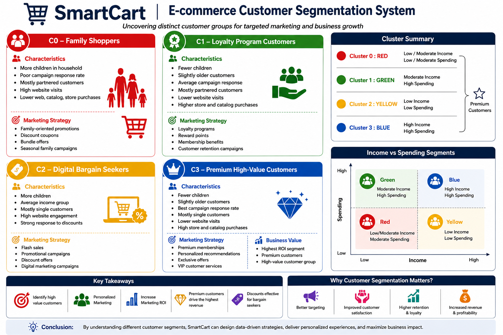

# 🛒 SmartCart: E-commerce Customer Segmentation System

## 📌 Overview

SmartCart is a Machine Learning project that segments e-commerce customers into meaningful groups using **K-Means Clustering** and **Agglomerative Clustering**. The objective is to understand customer behavior, identify high-value customer groups, and design targeted marketing strategies that improve customer retention and business revenue.

---

## 🚀 Technologies Used

- Python
- Pandas
- NumPy
- Matplotlib
- Seaborn
- Scikit-Learn
- K-Means Clustering
- Agglomerative Clustering
- Silhouette Score
- Jupyter Notebook

---

## 📊 Customer Segmentation Insights



The clustering analysis identified four major customer segments:

### 🔹 C0 – Family Shoppers

**Characteristics**
- More children in household
- Poor campaign response rate
- Mostly partnered customers
- High website visits
- Lower web, catalog, and store purchases

**Marketing Strategy**
- Family-oriented promotions
- Discount coupons
- Bundle offers
- Seasonal family campaigns

---

### 🔹 C1 – Loyalty Program Customers

**Characteristics**
- Fewer children
- Slightly older customers
- Average campaign response
- Mostly partnered customers
- Lower website visits
- Higher store and catalog purchases

**Marketing Strategy**
- Loyalty programs
- Reward points
- Membership benefits
- Customer retention campaigns

---

### 🔹 C2 – Digital Bargain Seekers

**Characteristics**
- More children
- Average income group
- Mostly single customers
- High website engagement
- Strong response to discounts

**Marketing Strategy**
- Flash sales
- Promotional campaigns
- Discount offers
- Digital marketing campaigns

---

### 🔹 C3 – Premium High-Value Customers

**Characteristics**
- Fewer children
- Slightly older customers
- Best campaign response rate
- Mostly single customers
- Lower website visits
- High store and catalog purchases

**Marketing Strategy**
- Premium memberships
- Personalized recommendations
- Exclusive offers
- VIP customer services

**Business Value**
- Highest ROI segment
- Premium customers
- High-value customer group

---

## 📈 Income vs Spending Segments

| Segment | Characteristics |
|----------|----------------|
| 🔵 Blue | High Income, High Spending (Premium Customers) |
| 🟢 Green | Moderate Income, High Spending |
| 🔴 Red | Low/Moderate Income, Moderate Spending |
| 🟡 Yellow | Low Income, Low Spending |

---

## 📉 Clustering Techniques Used

### K-Means Clustering
- Identified distinct customer groups
- Optimized cluster selection using Elbow Method
- Visualized customer behavior patterns

### Agglomerative Clustering
- Built hierarchical customer groups
- Validated cluster structures using Dendrogram
- Compared results with K-Means clustering

---

## 📋 Model Evaluation

The clustering performance was evaluated using:

- Elbow Method
- Silhouette Score
- Dendrogram Analysis
- Cluster Visualization
- Business Interpretability

---

## 💡 Key Business Insights

- Identified four distinct customer segments.
- Premium customers generate the highest business value.
- Loyalty programs can improve customer retention.
- Discount campaigns are highly effective for digital bargain seekers.
- Family shoppers respond better to promotional offers and coupons.
- Customer segmentation enables personalized marketing strategies.
- Data-driven decisions can improve marketing ROI.

---

## 📂 Repository Structure

```text
SmartCart-Customer-Segmentation/
│
├── Smart_cart.ipynb
├── README.md
├── requirements.txt
│
└── images/
    ├── business_insights.png
    ├── correlation_heatmap.png
    ├── elbow_method.png
    ├── Silhouette score.png
    └── customer_clusters.png
```

---

## ⚙️ Installation

```bash
git clone https://github.com/yourusername/SmartCart-Customer-Segmentation.git
cd SmartCart-Customer-Segmentation
pip install -r requirements.txt
jupyter notebook
```

---

## 🎯 Future Improvements

- Customer Lifetime Value Prediction
- Recommendation System
- RFM Analysis
- Streamlit Dashboard
- Real-Time Customer Segmentation

---

## 👨‍💻 Author

**Abhishek Nangare**

Final Year BE Student (Artificial Intelligence & Data Science)

### Areas of Interest
- Data Science
- Machine Learning
- Deep Learning
- Software Development

---

⭐ If you found this project useful, consider giving it a star.
